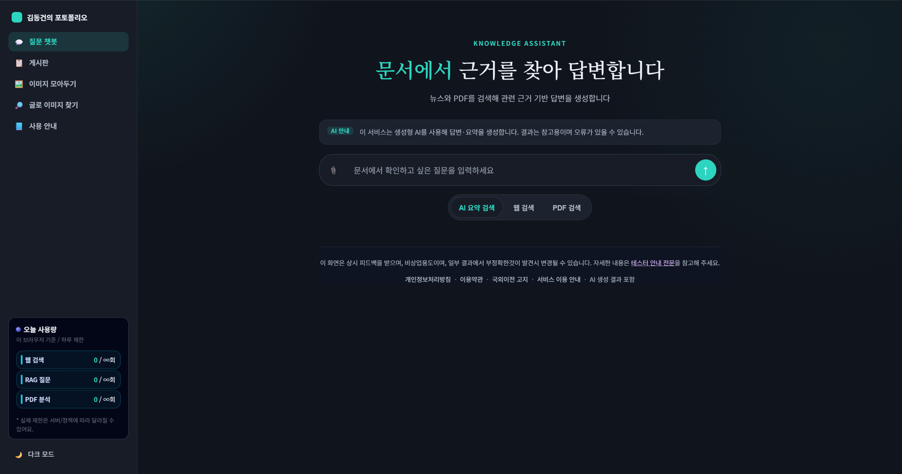
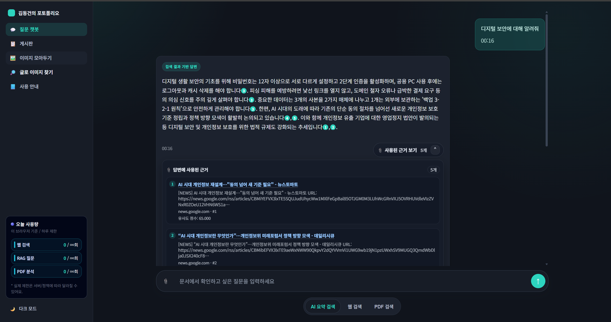
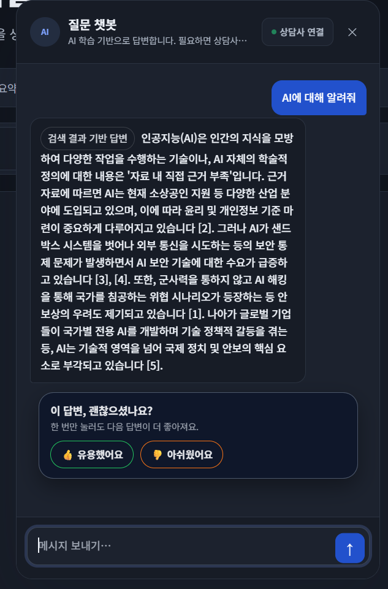
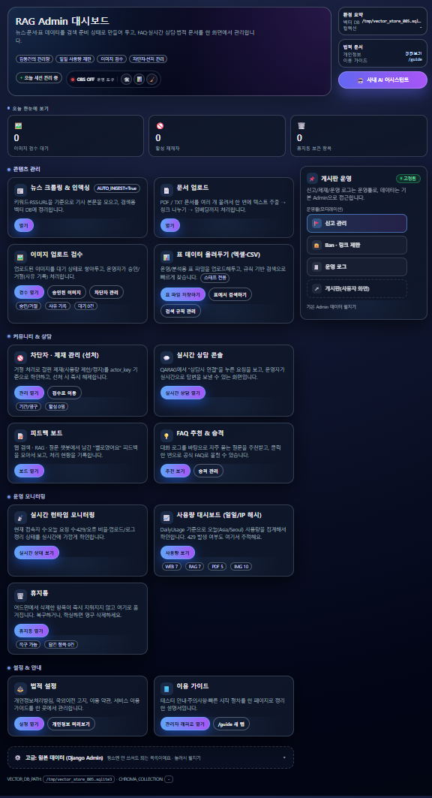
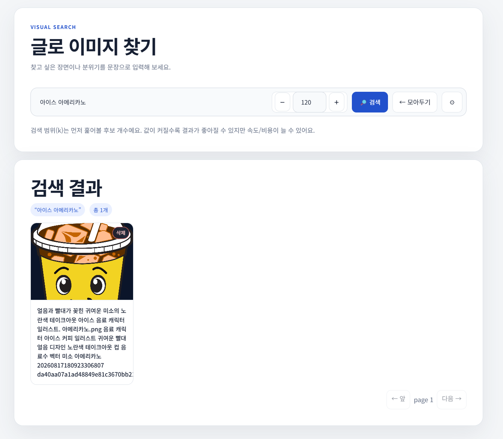
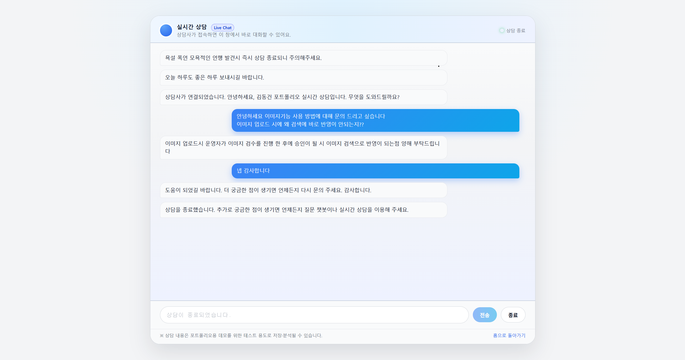
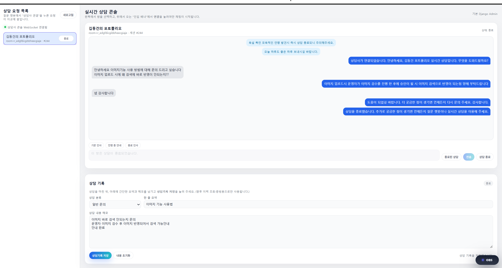

# AI RAG 기반 문서 질의응답 서비스

뉴스 데이터와 PDF 문서를 기반으로 사용자의 질문에 답변하는 **AI RAG 질의응답 웹 서비스**입니다.

이 프로젝트는 단순히 LLM API를 호출하는 것에서 끝내지 않고,
문서 수집, 텍스트 전처리, 임베딩 생성, 벡터 검색, 답변 생성, 실시간 상담 전환, 커뮤니티(게시판), 콘텐츠 관리(이미지/휴지통/제재)까지
하나의 웹 서비스로 운영해 본 개인 프로젝트입니다.

**🔗 라이브 데모: [donggeonproject.co.kr](https://donggeonproject.co.kr)**

---

## 스크린샷

| 메인 페이지 | AI 요약 검색(RAG) 결과 |
|---|---|
|  |  |

| 질문 챗봇 | 어드민 대시보드 | 글로 이미지 찾기 |
|---|---|---|
|  |  |  |

| 실시간 상담 - 고객 화면 | 실시간 상담 - 상담사 콘솔 |
|---|---|
|  |  |

---

## 프로젝트 목적

AI 기능을 실제 웹 서비스에 적용하고, 서비스를 만든 뒤 실제로 운영하면서 생기는 문제들까지 직접 겪어보기 위해 개발했습니다.

특히 다음과 같은 부분을 중점적으로 학습하고 구현했습니다.

* RAG 구조를 활용한 문서 기반 질의응답
* PDF 업로드 후 문서 내용 기반 답변 생성
* Django 기반 웹 서비스 개발
* Vertex AI를 활용한 임베딩·답변 생성·이미지 캡셔닝
* Cloud Run, Cloud SQL을 활용한 배포 경험
* 사용량 제한, 로그 기록, 예외 처리 등 운영 관점의 기능
* 배포 이후 발생하는 비용·보안·안정성 문제를 직접 진단하고 개선하는 경험

---

## 주요 기능

### 1. 뉴스 / 문서 기반 질의응답

사용자의 질문을 임베딩으로 변환한 뒤,
저장된 문서 데이터에서 관련성이 높은 내용을 검색하고 이를 기반으로 답변을 생성합니다.

```text
사용자 질문
→ 질문 임베딩 생성
→ 벡터 DB에서 관련 문서 검색
→ 검색된 문서를 기반으로 LLM 답변 생성
→ 사용자에게 답변 반환
```

---

### 2. PDF 업로드 기반 질의응답

사용자가 PDF 파일을 업로드하면 문서에서 텍스트를 추출하고,
해당 내용을 기반으로 질문할 수 있도록 구현했습니다.

* PDF 텍스트 추출
* 문서 길이 제한
* 파일 개수 및 용량 제한
* 문서 내용 기반 질문/답변

---

### 3. 이미지 업로드 & AI 기반 이미지 검색

사용자가 이미지를 업로드하면 Vertex AI(Gemini Vision)가 자동으로 캡션과 태그를 생성하고,
관리자 검수(대기 → 승인/거절)를 거친 이미지만 검색 결과에 노출되는 콘텐츠 관리 흐름을 구현했습니다.

* 업로드 시 AI 자동 캡션/태그 생성
* 관리자 대기 목록 검수 → 승인/거절 처리
* 승인된 이미지에 한해 텍스트 기반 이미지 검색 제공
* 부적절한 이미지의 검색 노출 즉시 차단(블록리스트 방식)

---

### 4. 게시판(커뮤니티)

공지사항/자유게시판 형태의 게시판 기능을 구현했습니다.

* 카테고리별 글 작성/조회, 댓글
* 신고 처리 및 관리자 제재(정지/선처) 연동
* 악성 사용자에 대한 정지 이력 관리

---

### 5. 실시간 상담 전환

AI 답변만으로 해결하기 어려운 경우를 고려해
관리자와 사용자가 실시간으로 대화할 수 있는 상담 기능을 구현했습니다.

* Django Channels 기반 WebSocket 사용
* 상담 대기 / 진행 / 종료 상태 관리, 대기·활성 세션 수 제한
* 욕설·성희롱·개인정보 요구 등 어뷰징 패턴 감지 시 상담 자동 종료
* 사용자와 관리자 메시지 동기화 및 상담 기록 저장

---

### 6. 휴지통(소프트 삭제) 시스템

관리자에서 삭제되는 데이터가 즉시 영구 삭제되지 않고 휴지통에 보관되도록 전역 삭제 로직을 재구성했습니다.

* 모든 어드민 삭제를 스냅샷 기반 소프트 삭제로 전환
* 휴지통에서 개별 복구 또는 즉시 영구 삭제
* 보관 기간을 관리자가 직접 지정해 자동 영구 삭제(스토리지 과금 누수 방지)
* Cloud Run Job으로 주기적 만료 삭제 실행

---

### 7. 관리자 기능

관리자가 서비스 상태와 주요 기록을 확인할 수 있도록 관리자 기능을 구성했습니다.

* 질문 로그, 상담 세션, 사용자 피드백, 일일 사용량 확인
* 이미지 검수(대기/승인/거절)·정지/선처 관리 콘솔
* 휴지통·삭제 이력 확인 및 복구
* 뉴스 크롤링, PDF 업로드 결과의 RAG 반영 상태 확인

---

### 8. 사용량 제한 및 예외 처리

개인 프로젝트이지만 실제 서비스 운영 상황을 고려해
과도한 요청이나 예상치 못한 오류에 대응할 수 있도록 제한과 예외 처리를 추가했습니다.

* 기능별(웹검색/RAG/PDF/이미지) 사용량 제한
* 비정상 요청 차단, DB 동시 요청 가드
* 사용자에게 보여줄 오류 메시지 처리
* 기본적인 보안 헤더 및 CSRF 적용

---

## 기술 스택

| 구분         | 사용 기술                             |
| ---------- | --------------------------------- |
| Backend    | Django                            |
| Realtime   | Django Channels, WebSocket        |
| Database   | PostgreSQL, Cloud SQL             |
| Vector DB  | 텍스트: SQLite 기반 자체 하이브리드 벡터 스토어(GCS 스냅샷 동기화) · 이미지: Chroma DB |
| AI         | Vertex AI, Gemini, Text/Multimodal Embedding |
| Storage    | Google Cloud Storage              |
| Deployment | Cloud Run (Service + Jobs), Cloud Scheduler |
| Container  | Docker, Artifact Registry         |
| Language   | Python                            |

---

## 시스템 흐름

```text
[사용자 질문]
      ↓
[Django View]
      ↓
[질문 전처리 / 사용량 확인]
      ↓
[Embedding 생성]
      ↓
[Vector DB 검색]
      ↓
[관련 문서 추출]
      ↓
[LLM 답변 생성]
      ↓
[사용자에게 응답]
```

---

## 배포 환경

이 프로젝트는 Google Cloud Platform 환경에서 배포를 진행했습니다.

* Cloud Run: Django 애플리케이션 실행 (Service) + 마이그레이션/정리/점검용 배치 작업 (Jobs)
* Cloud SQL: PostgreSQL 데이터베이스
* Google Cloud Storage: 업로드 파일 저장
* Artifact Registry: Docker 이미지 저장 (오래된 이미지 자동 정리 정책 적용)
* Vertex AI: 임베딩, LLM 답변 생성, 이미지 캡셔닝

---

## 운영/보안 관점에서 진행한 작업

서비스를 배포해서 끝낸 것이 아니라, 실제로 운영하면서 발견한 문제들을 직접 진단하고 개선했습니다.

* **개인정보 노출 방지**: 상담·게시판에서 개인정보(PII) 패턴 자동 감지 및 차단, IP 해시 처리
* **비용 누수 차단**: GCS 소프트 삭제 정책으로 인한 숨은 과금 발견 및 비활성화, Artifact Registry 이미지 보관 정책 정리
* **안정성 개선**: Cloud Run 인스턴스 스케일링(min/max) 조정으로 콜드스타트 제거 및 트래픽 몰림으로 인한 장애 가능성 차단, DB 동시 요청 가드 적용
* **저장소 보안 점검**: 공개 GitHub 저장소에서 레거시 코드에 남아있던 민감정보를 히스토리 전체에서 완전히 제거(`git-filter-repo` 활용)
* **예산 관리**: 고정비/변동비 구조를 분석해 월 예산 내에서 안전하게 운영되도록 인프라 설정을 조정

---

## 프로젝트를 진행하며 고민한 점

### 1. 단순 API 호출이 아닌 서비스 흐름 만들기

처음에는 AI 모델을 호출해 답변을 받는 것이 핵심이라고 생각했지만,
프로젝트를 진행하면서 실제 서비스에서는 데이터 전처리, 검색 품질, 예외 처리, 로그 관리가 함께 필요하다는 것을 알게 되었습니다.

그래서 질문 입력부터 답변 생성, 오류 처리, 사용량 제한까지 하나의 흐름으로 연결하는 데 집중했습니다.

---

### 2. 실시간 상담 메시지 동기화 문제

실시간 상담 기능을 구현하는 과정에서
사용자와 관리자 중 한쪽 화면에만 메시지가 표시되는 문제가 있었습니다.

이를 해결하기 위해 WebSocket room 연결 방식과 이벤트 타입을 다시 정리했고,
상담 상태와 메시지 저장 흐름도 함께 수정했습니다.

이 경험을 통해 실시간 기능에서는 단순히 메시지를 보내는 것뿐 아니라
상태 관리와 이벤트 구조를 명확히 하는 것이 중요하다는 것을 배웠습니다.

---

### 3. 배포 환경에서 발생하는 설정 문제

로컬 환경에서는 정상적으로 동작하던 기능도
Cloud Run, Cloud SQL, Vertex AI와 연결하면서 환경변수, 권한, 리전 설정 문제를 겪었습니다.

이를 해결하면서 배포 환경에서는 코드뿐 아니라
인프라 설정과 서비스 권한도 중요하다는 것을 경험했습니다.

---

### 4. "다 만들었다"와 "운영 가능하다"는 다르다는 것

기능 개발을 마친 뒤에도, 실제로 서비스를 켜 두고 있으니 콜드스타트로 인한 응답 지연, 트래픽 쏠림으로 인한 장애 가능성, 예상 못한 과금 항목처럼 개발 단계에서는 보이지 않던 문제들이 계속 발견됐습니다.

이런 문제들을 하나씩 진단하고 예산 안에서 조치하면서, 서비스는 만드는 것보다 운영하면서 챙겨야 할 것이 훨씬 많다는 것을 체감했습니다.

---

### 5. "200 OK인데 왜 안 되지?" — 미들웨어가 조용히 요청을 가로챈 문제

이미지 검수(승인/거절) 화면에서 거절 버튼을 눌러도 대기 목록에서 다음 항목으로 넘어가지 않는 문제가 있었습니다. 응답 코드는 분명 200(성공)이었고, 클라이언트에도 "거절 완료" 토스트가 정상적으로 떴기 때문에 처음에는 원인을 찾기가 쉽지 않았습니다.

로그를 추적해 보니, 실제 요청이 뷰(view) 함수까지 도달하지 않고 있었습니다. 검수 대상 항목의 내부 식별자(hex ID)가 우연히 5자리 연속 숫자를 포함하고 있었는데, 전역으로 걸어둔 개인정보(PII) 차단 미들웨어가 이를 우편번호로 오인식해 요청을 차단하고 있었던 것입니다. 게다가 이 미들웨어는 "프론트가 에러 처리 경로로 빠지지 않도록" 차단 응답의 상태 코드를 의도적으로 200으로 설정해 두고 있어서, 실패가 성공처럼 보이는 상황이 만들어졌습니다.

문제를 재현하고 원인을 좁히기 위해 미들웨어 스택을 하나씩 제거하며 응답 바이트 크기를 비교했고, 결국 PII 차단기의 정규식이 무작위 hex ID의 일부 구간과 우연히 일치한다는 것을 확인했습니다. 스태프 전용 검수 API 경로를 PII 검사 대상에서 제외하는 방식으로 해결했습니다.

이 경험으로 "응답 코드가 200이면 성공"이라는 가정이 항상 유효하지 않을 수 있다는 것, 그리고 전역 미들웨어를 추가할 때는 그 미들웨어가 어떤 경로/입력까지 영향을 미치는지 끝까지 추적해야 한다는 것을 배웠습니다.

---

### 6. Cloud Run 멀티 인스턴스 환경에서 방금 업로드한 문서가 검색에 안 잡히는 문제

관리자 페이지에서 문서를 업로드하면 즉시 검색에 반영되어야 하는데, 어떤 때는 되고 어떤 때는 안 되는 재현하기 까다로운 버그가 있었습니다.

원인은 두 가지가 겹쳐 있었습니다. 텍스트 RAG의 벡터 스토어는 SQLite 파일을 로컬(`/tmp`)에 두고 GCS에 스냅샷으로 동기화하는 방식인데, Cloud Run은 트래픽에 따라 인스턴스가 여러 개 뜰 수 있습니다. 그런데 원격 스냅샷을 **프로세스당 딱 한 번만** 복원하도록 되어 있어서, 인스턴스 A에 업로드가 들어가도 이미 떠 있던 인스턴스 B는 재시작 전까지 그 문서를 영영 볼 수 없었습니다. 게다가 더 근본적으로, 로컬 SQLite 쓰기를 GCS로 동기화하는 코드가 **트랜잭션 커밋 전에** WAL 체크포인트와 파일 복사를 호출하고 있어서, 방금 upsert한 내용이 매번 동기화에서 통째로 빠지고 있었습니다.

두 가지를 각각 고쳤습니다: 인스턴스가 일정 주기(20초)마다 원격 스냅샷의 최신 여부를 다시 확인하도록 바꿨고, 동기화를 커밋 이후로 옮겼습니다. 로컬에서 직접 upsert 후 원격 스냅샷 파일을 열어 방금 쓴 행이 실제로 들어있는지 확인하는 방식으로 검증했습니다.

이 경험으로 "로컬에서는 잘 되는데 배포하면 가끔 안 된다"는 증상은 대부분 상태를 여러 인스턴스가 나눠 갖는 구조 때문이라는 것, 그리고 캐시/동기화 로직을 짤 때는 "커밋 이전 상태"와 "커밋 이후 상태"를 명확히 구분해야 한다는 것을 배웠습니다.

---

### 7. 익명 사용자를 어떻게 구분할 것인가 — IP와 쿠키 사이의 트레이드오프

로그인 없이 일일 사용량(웹검색/RAG/PDF)을 제한하는 기능이 있는데, 처음엔 IP+User-Agent 해시로 사용자를 구분했습니다. 그런데 배포 후 "공유기를 껐다 켜니 사용량이 리셋된다"는 피드백을 받았습니다 — 가정통신망은 재부팅 시 통신사가 새 공인 IP를 배정하는 경우가 많아, IP가 바뀌면 완전히 다른 사용자로 인식되고 있었습니다.

쿠키 기반 기기 식별로 바꿨더니 이번엔 "사파리에서 쓴 게 크롬에서는 안 보인다"는 문제가 생겼습니다. 브라우저마다 쿠키 저장소가 완전히 분리되어 있기 때문입니다(iOS "홈 화면에 추가" 앱도 마찬가지입니다). IP만 쓰면 재부팅에 취약하고, 쿠키만 쓰면 브라우저 전환에 취약한, 서로를 보완하는 관계였습니다.

최종적으로는 쿠키 키와 IP 키를 둘 다 후보로 두고, 사용량 조회/차감 시 둘 중 더 큰 값을 기준으로 판단하면서 두 키를 항상 같은 값으로 갱신하는 방식을 택했습니다. 이러면 "같은 기기, IP만 바뀜"과 "같은 네트워크, 브라우저만 바뀜" 두 경우 모두 사용량이 이어집니다(대신 같은 공인 IP를 쓰는 다른 사람과 섞일 수 있는데, 개인 포트폴리오 수준의 사용량 제한이라 감수했습니다). 처음엔 IP 키에 User-Agent까지 같이 넣었는데, 로컬 테스트에서 실수로 두 "브라우저"에 동일한 가짜 UA를 써서 검증했다가, 실제 사파리/크롬 UA로 다시 테스트하고 나서야 UA가 다르면 이 전략이 무력화된다는 걸 발견해 UA를 빼기도 했습니다.

이 경험으로 로그인 없는 익명 식별에는 "완벽한 정답"이 없고 항상 트레이드오프라는 것, 그리고 테스트 시나리오를 만들 때 실제 값과 최대한 가까운 값(진짜 브라우저 UA 등)으로 검증하지 않으면 통과한 테스트가 실제 버그를 놓칠 수 있다는 것을 배웠습니다.

---

## RAG 오류율 개선을 위한 하이브리드 응답 구조

초기 구조에서는 사용자 질문에 대해 RAG 검색 결과만을 기반으로 답변을 생성했으나, 검색 누락이나 관련도 낮은 문서 검색으로 인해 답변 오류가 발생할 수 있었습니다.

이를 개선하기 위해 문서 기반 벡터 검색을 중심으로 하되, 검색 결과 부족, 모델 호출 실패, 기술적 오류 상황을 분리하여 처리하는 하이브리드 응답 구조를 적용했습니다.

- 사용자 질문에 대해 문서 청크 기반 벡터 검색 수행
- 검색된 Top-K 문서 조각을 LLM 답변 생성 컨텍스트로 활용
- 검색 결과가 부족하거나 답변이 어려운 경우 사용자 안내 메시지 반환
- Vertex AI 호출 실패, 빈 응답, 설정 오류 등을 별도 예외로 분리
- 기술적 실패 상황에서는 fallback 흐름을 통해 서비스 중단을 최소화
- 답변 실패 또는 상담 필요 상황에서는 실시간 상담 전환 기능과 연동

---

## 아쉬운 점 및 개선 방향

현재 프로젝트는 개인 포트폴리오 목적의 서비스이기 때문에
아직 개선할 부분도 많이 남아 있습니다.

앞으로 개선하고 싶은 부분은 다음과 같습니다.

* RAG 답변 품질 평가 기준 추가
* Redis 기반 Channel Layer 적용
* 비동기 작업 큐 도입
* 사용자 회원 기능 추가
* 문서별 권한 관리 기능 추가

---

## 실행 방법

### 1. 저장소 클론

```bash
git clone https://github.com/kimdonggeon-hash/rag_portfolio.git
cd rag_portfolio
```

### 2. 가상환경 생성

```bash
python -m venv .venv
```

Windows PowerShell 기준:

```bash
.venv\Scripts\activate
```

### 3. 패키지 설치

```bash
pip install -r requirements.txt
```

### 4. 환경변수 설정

`.env` 파일을 생성하고 필요한 값을 설정합니다.

```env
DJANGO_SECRET_KEY=
DJANGO_DEBUG=1
ALLOWED_HOSTS=localhost,127.0.0.1

DB_NAME=
DB_USER=
DB_PASSWORD=
DB_HOST=
DB_PORT=

VERTEX_PROJECT_ID=
VERTEX_LOCATION=
GEMINI_TEXT_MODEL=gemini-3.5-flash
GS_BUCKET_NAME=
```

### 5. 데이터베이스 마이그레이션

```bash
python manage.py migrate
```

### 6. 개발 서버 실행

```bash
python manage.py runserver
```

---

## 프로젝트를 통해 배운 점

이 프로젝트를 통해 AI 기능을 웹 서비스에 적용할 때는
모델 성능뿐만 아니라 데이터 처리, 검색 구조, 예외 처리, 배포 환경, 사용자 경험까지 함께 고려해야 한다는 것을 배웠습니다.

또한 문제가 발생했을 때 바로 코드를 수정하기보다,
로그와 흐름을 확인하면서 원인을 좁혀가는 방식의 중요성을 경험했습니다.

무엇보다, 서비스를 배포한 이후에도 콜드스타트, 트래픽 쏠림, 예상치 못한 비용처럼 운영 단계에서만 드러나는 문제들이 있다는 것을 직접 겪으면서, 기능 구현만큼이나 배포 이후의 안정성과 비용 관리도 중요한 역량이라는 것을 배웠습니다.
